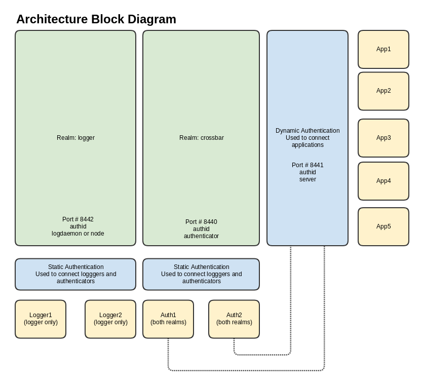

## Micro-Services Example

The intention of this repository is to provide examples of possible solutions to common
architectural problems. It will hopefully evolve as better methods are identified and new
features are added to Crossbar. It is **NOT** intended to be a definitive guide to how to
solve the problems listed, just one set of possibilities.

### Initially we are looking at

- Connecting microservices to Crossbar via TLS client certificates
  - creating server certificates programmatically
  - creating client-side certificates programatically
- Dynamic authentication for TLS client certificates
- Dynamic authorization
- Handing off dynamic authorization / authentication to separate processes
- Round robin registrations for high(er) availability
- Connecting to and interacting to multiple realms

### Getting started
After checking out the repository and assuming you have a standard set of Python development tools at your disposal, start by buildng a virtual environment and installing the local dependencies;

```bash
mkvirtualenv -p /usr/bin/python3 ms-demo
pip install pipenv
pipenv install
```

Next, you'll need to build some local certificates. This will mostly be fairly quick however making a **dhparam.pem** file may take a couple of minutes. Note the script will build a 2048 bit key, for production you should consider whether you to use a 4096 bit key. (this would take considerably **longer** to generate)

```bash 
make rebuild
```

Next, start Crossbar

```bash
crossbar start
```

Then the loggers, authenticators, and finally the dummy microservices

```bash
make run_logger
make run_auth
make run_application
```

Note that this will make a while bunch of processes in the background that will compete for **stdout** so typing may become *interesting*, alternatively you can start the individual process by hand in separate terminal windows.

You should see something like this on the Crossbar console as things start to power up;

```bash
2018-07-01T16:25:22+0100 [Router       1135] + "logdaemon" on realm "logger" CN="log1" COMPANY="XBR" SHA="96:CD:67:CF:05:9B:3A:3C:83:F2:DA:4F:F3:72:E0:2F:E3:68:3D:05"
2018-07-01T16:25:22+0100 [Router       1135] + "logdaemon" on realm "logger" CN="log2" COMPANY="XBR" SHA="D6:5E:86:50:F8:99:50:A8:0D:E7:F0:4D:1C:F0:73:AB:1F:BD:E0:65"
2018-07-01T16:25:34+0100 [Router       1150] + "authenticator" on realm "crossbar" CN="auth1" COMPANY="XBR" SHA="3C:A1:4A:2F:13:01:DA:63:BF:21:87:18:74:F2:BB:BE:4E:AF:DB:24"
2018-07-01T16:25:34+0100 [Router       1150] + "authenticator" on realm "crossbar" CN="auth2" COMPANY="XBR" SHA="C3:F8:DF:53:28:3A:AE:BD:A2:D0:FE:45:22:68:F1:AE:91:E7:55:2E"
2018-07-01T16:25:34+0100 [Router       1135] + "node" on realm "logger" CN="auth1" COMPANY="XBR" SHA="3C:A1:4A:2F:13:01:DA:63:BF:21:87:18:74:F2:BB:BE:4E:AF:DB:24"
2018-07-01T16:25:34+0100 [Router       1135] + "node" on realm "logger" CN="auth2" COMPANY="XBR" SHA="C3:F8:DF:53:28:3A:AE:BD:A2:D0:FE:45:22:68:F1:AE:91:E7:55:2E"
```

Note that each of the two authenticators connects with the same authid, but a differrent client certificate, so in the authenticator it's the client certificate (fingerpring or sha1) that is used to identify individual instances. There is no 'actual' implemented filtering here with regards to *who* can connect, but all the authenticator needs to do to add this behaviour is check the authid / fingerprint combination and throw an exception if the combination is not expected or allowed.

You will see that the log daemon is connecting to and accepting messages only from the *logger* realm, and the auth daemon is operating on the *crossbar* realm, but also connecting to the *logger* realm. (which is where it sends it is sending logging information)

### How it fits together

The first thing to do is to check out the diagram, we've implemented two realms, each of which has it's own router. Traffic will be isolated on a per-realm basis, i.e. no traffic from one realm with enter the other, and each router will run in it's own process to help with load distribution.



Connecting to the **crossbar** realm on port 8440 using a TLS client certificate will use *static* authorizers and authenticators to validate the connection and traffic. This  facilitates the use of dynamic authenticators, who as stand-alone processes also need to authenticate before they can start providing their authentication and authorization services. Once the **auth** processes have been authorized using the static credentials, we can make connections to the **crossbar** realm on port 8441, again using TLS client certificates but this time authentication and authorization will be dynamically provided by functions within the **auth** processes. As we have two auth services registering the same routines on a round-robin mapping, we should be able to do a rolling update to restart or update the **auth** processes without any outage or loss of function.

Note that we also have two loggers, and some logging will be split over the two daemons - this is purely to demonstrate that it's possible with regards to HA functionality, not necessarrily a recommendation. In practice you would need some sort of de-dup facility for the join/leave events as both daemons subscribe to wamp meta events which would lead to some duplication.

### Things to be aware of / disclaimer

- Currently this codebase has been compiled from historical examples and code, it may contain some snippets that are redundant or indeed use some methods that have since been superceeded. We will improve on this over time.

- Part of the example was (is) to include a UI to view the output from the logging daemon, you may see some artifacts in the code relating to this, however the code itself is not yet included.

- The ***utils*** folder contains programmatic examples (python) of how to create both server and related client certificates, but currently only handled self-signed certificates.

- Profiles are handled using .INI files. This isn't necessarily a right or wrong way to handle settings and it may or may not suit your needs, also included are ***argparse*** examples if that's your preference, or if you're using a PAAS (Heroku, CF etc) you will probably want to convert to environment variables.

- The ***certs*** folder is / should not be included in the repo, this is generated and populated automatically when you do a **make rebuild**.

- Please refer to the ***Makefile*** for tips on how to run the components.

### Misc

- TODO :: Tiny UI to view logs
- TODO :: Example using letsEncrypt certificates
